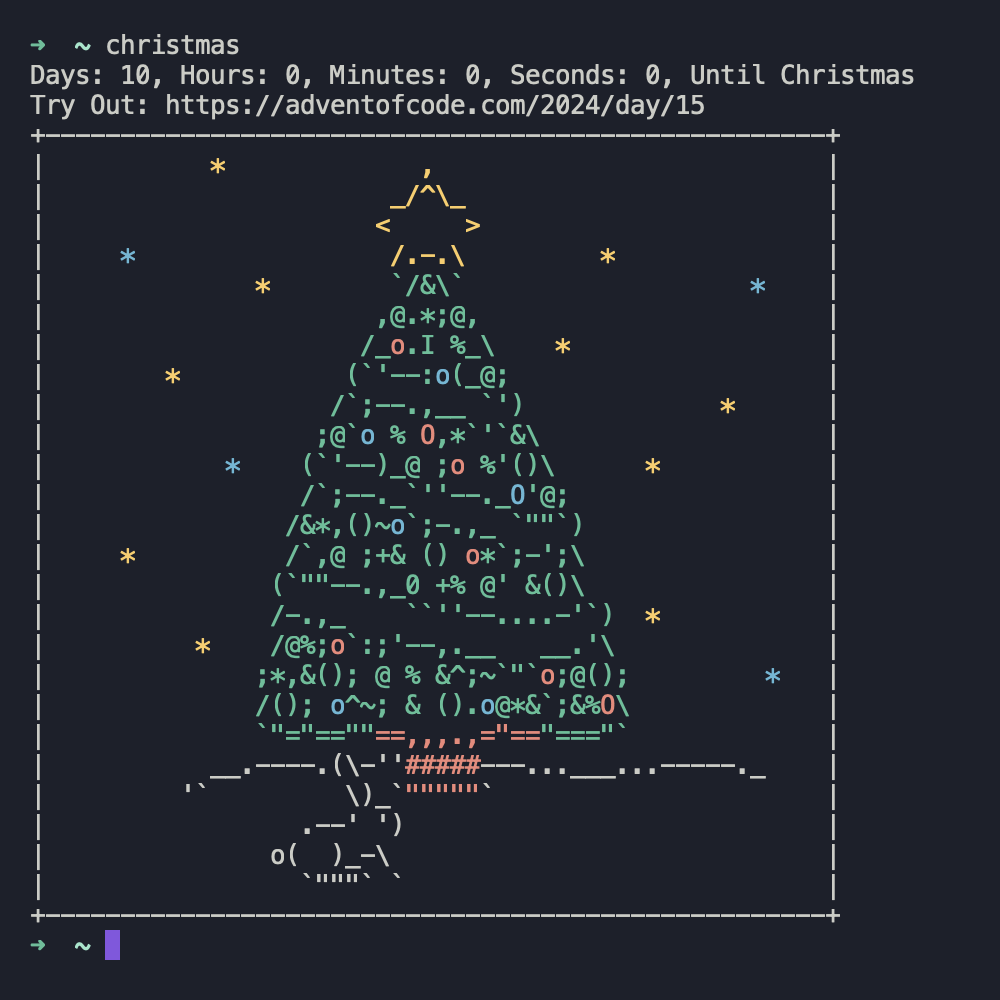

# Terminal Christmas Countdown




## Installation
### Linux and MacOS
```sh
mkdir -p ~/.local/bin
curl -o ~/.local/bin/ https://raw.githubusercontent.com/carter4299/christmas-counter/main/zig-out/bin/christmas

#bash
echo "export PATH=\$HOME/.local/bin/:\$PATH" >> ~/.bashrc
echo "christmas" >> ~/.bshrc 
#zsh
echo "export PATH=\$HOME/.local/bin/:\$PATH" >> ~/.zshrc
echo "christmas" >> ~/.zshrc 
#fish
echo "set -gx PATH ~/.local/bin \$PATH" >> ~/.config/fish/config.fish
echo "christmas" >> ~/.config/fish/config.fish
```

## Building
```sh
git clone https://github.com/carter4299/christmas-counter.git
cd christmas-counter
zig build

mkdir -p ~/.local/bin
cp zig-out/bin/christmas ~/.local/bin
```